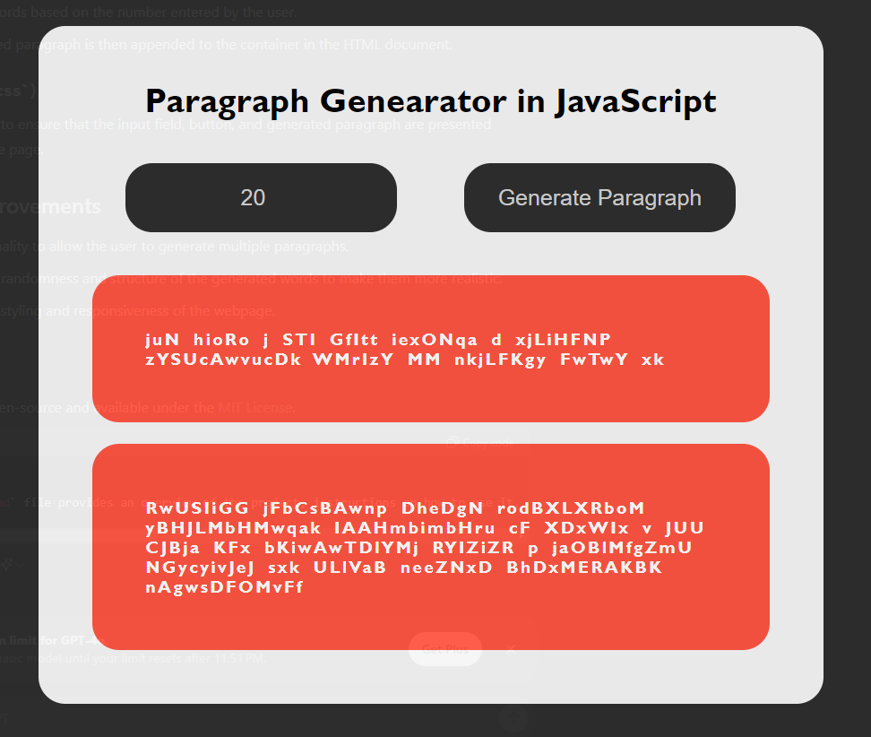

# Paragraph Generator in JavaScript

This project is a simple web-based application that generates a random paragraph of a specified number of words. The paragraph consists of randomly generated words, and you can customize the number of words in the paragraph using the input field provided.

## Table of Contents

- [Paragraph Generator in JavaScript](#paragraph-generator-in-javascript)
  - [Table of Contents](#table-of-contents)
  - [Features](#features)
  - [Technologies Used](#technologies-used)
  - [Usage](#usage)
  - [Screenshots](#screenshots)
  - [File Structure](#file-structure)
  - [Code Explanation](#code-explanation)
    - [HTML (`index.html`)](#html-indexhtml)
    - [JavaScript (`script.js`)](#javascript-scriptjs)
    - [CSS (`style.css`)](#css-stylecss)
  - [Future Improvements](#future-improvements)
  - [License](#license)

## Features

- Input field to specify the number of words in the generated paragraph.
- Randomly generated words consisting of letters from the English alphabet.
- The generated paragraph is displayed dynamically on the webpage.

## Technologies Used

- HTML5
- CSS3
- JavaScript (ES6)

## Usage

1. Open the `index.html` file in your browser.
2. Enter the number of words you want in the paragraph in the input field.
3. Click the "Generate Paragraph" button.
4. The generated paragraph will appear on the page.

## Screenshots

<table style="width: 100%; text-align: center;">
  <tr>
    <td>
      
    </td>
  </tr>
</table>

## File Structure

```code
.
├── index.html
├── style.css
└── script.js
```

- **index.html**: Contains the basic structure and layout of the webpage.
- **style.css**: Provides styling for the webpage elements.
- **script.js**: Contains the JavaScript logic for generating the random paragraph.

## Code Explanation

### HTML (`index.html`)

- The `input` element with the id `numberOfWords` allows the user to enter the number of words they want in the generated paragraph.
- The `button` element triggers the `generatePara()` function, which generates the random paragraph and displays it.

### JavaScript (`script.js`)

- The `generateWords` function generates a random string of letters.
- The `generatePara` function creates a new paragraph element (`<p>`) and fills it with randomly generated words based on the number entered by the user.
- The generated paragraph is then appended to the container in the HTML document.

### CSS (`style.css`)

- Basic styling to ensure that the input field, button, and generated paragraph are presented clearly on the page.

## Future Improvements

- Add functionality to allow the user to generate multiple paragraphs.
- Enhance the randomness and structure of the generated words to make them more realistic.
- Improve the styling and responsiveness of the webpage.

## License

This project is open-source and available under the [MIT License](LICENSE).

This `README.md` file provides an overview of the project, instructions on how to use it, and a brief explanation of the code. You can further customize it to include any additional information specific to your project.
